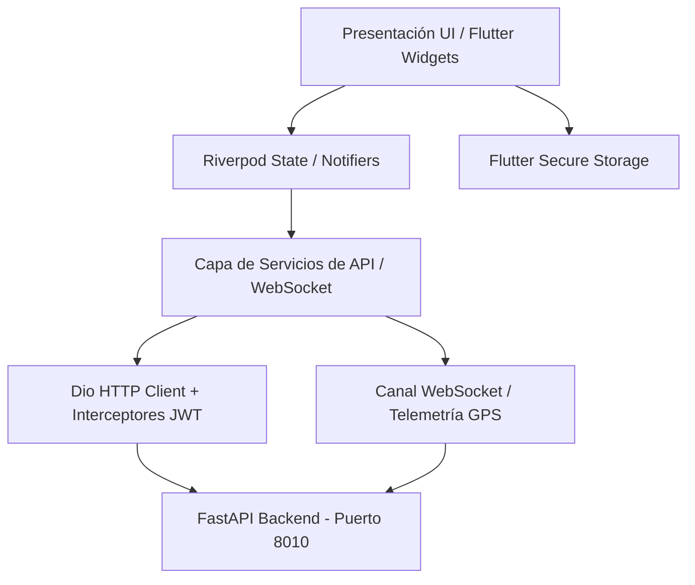

# Arquitectura del Frontend — BarboYa Superapp

## 1. Visión General
BarboYa es una superapp móvil y web desarrollada con **Flutter** y **Dart (Null Safety)** orientada a la prestación de servicios locales en Barbosa y el área metropolitana (transporte de pasajeros tipo inDrive/Move, comercio de comida con delivery tipo Rappi, y mensajería urbana de paquetes).

La aplicación está diseñada sobre una arquitectura modular por características (*Feature-First*), desacoplando la capa de presentación, la gestión de estado reactivo y el acceso a datos.

---

## 2. Diagrama de Arquitectura



---

## 3. Estructura de Directorios

```
mobile_app/lib/
├── core/
│   ├── config/              # AppConfig con soporte --dart-define (API_URL, WS_URL)
│   ├── network/             # DioClient, interceptor de Bearer Token y manejo de excepciones
│   ├── routing/             # GoRouter con navegación declarativa y protección de rutas
│   ├── security/            # SecureStorage con persistencia de JWT y perfil de usuario
│   ├── theme/               # AppTheme: Sistema de diseño "Electric Lime" (#CCFF00) & "Dark Charcoal" (#121212)
│   └── widgets/             # Componentes compartidos (BarboYaCard, PrimaryButton, StatusBadge, etc.)
├── features/
│   ├── admin/               # Panel administrativo: gestión de usuarios, aprobación y reportes
│   ├── auth/                # Login, registro multifuncional con selección de rol y splash screen
│   ├── cart/                # Carrito de comida, invariante de comercio único y selección de entrega
│   ├── commerces/           # Detalle de restaurantes y catálogo de productos
│   ├── delivery/            # Dashboard del repartidor: aceptación con bloqueo atómico y pedidos listos
│   ├── home/                # Inicio del cliente: acceso a transporte, comida, envíos y comercios
│   ├── merchant/            # Panel de cocina del restaurante: preparación de pedidos y catálogo
│   ├── notifications/       # Bandeja de notificaciones en tiempo real del usuario
│   ├── orders/              # Historial y detalle de pedidos con calificación de 5 estrellas
│   ├── profile/             # Visualización de datos, rol activo y cierre de sesión seguro
│   ├── rides/               # BarboYa Move: solicitud de viajes carro/moto y negociación de precio
│   └── shipments/           # BarboYa Envíos: cotización de paquetería urbana y código de entrega
└── shared/
    ├── models/              # Modelos de dominio coincidentes con esquemas Pydantic del backend
    ├── providers/           # Inyección de dependencias con Riverpod
    └── services/            # Servicios HTTP y WebSocket por módulo
```

---

## 4. Principios y Patrones Implementados

### 4.1 Gestión de Estado con Riverpod
- **Inmutabilidad y Reactividad:** Uso de `StateNotifier` (`CartNotifier`) y `FutureProvider` para consultas asíncronas con cacheo inteligente.
- **Invalidación Precisa:** Uso de `ref.invalidate(...)` para refrescar vistas tras mutaciones en servidor sin recrear instancias innecesarias.

### 4.2 Invariantes de Negocio en el Cliente
- **Comercio Único en el Carrito:** Al agregar productos de un comercio diferente, el carrito se reinicia de manera transparente notificando al usuario para asegurar coherencia con las órdenes del backend.
- **Negociación de Tarifas (inDrive style):** Soporte en `rides_screen.dart` para contraofertas de precio (`precio_propuesto`) conforme al modelo `ViajePasajero` de FastAPI.
- **Códigos de Seguridad de 4 Dígitos:** Para entregas de paquetes y viajes, se valida y muestra el código generado por el backend (`codigo_entrega`, `codigo_confirmacion`).

### 4.3 Red y Seguridad
- **Timeouts Razonables:** 10 segundos para conexión y recepción en `DioClient`.
- **Inyección Automática de Token:** El interceptor de Dio consulta `SecureStorage.getToken()` e incluye el encabezado `Authorization: Bearer <token>` en cada solicitud.
- **Tratamiento Centralizado de Errores:** Mapeo de códigos HTTP (`400`, `401`, `403`, `404`, `409`, `422`, `500`) a mensajes claros en español.
